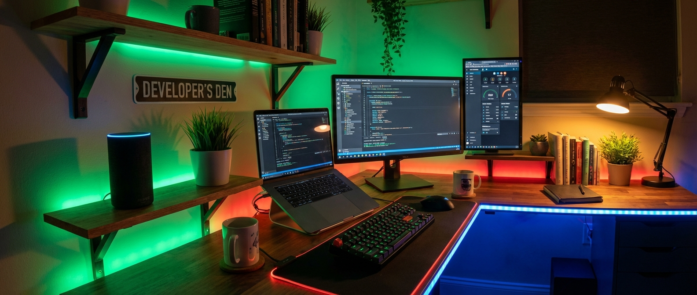

# smart-home-workflow 💡 — Govee lights + Alexa as developer workflow UI.

<p align="center">
  
</p>

<p align="center">
  
  
  
  
</p>

Developer workflow feedback through smart home devices. Govee LED lights change color based on system events — green on deploy success, red on failure, blue while processing, purple when AI is thinking. Alexa announces build status, test results, and alerts via VoiceMonkey. Your room becomes your dashboard.

> ⚠️ This is a closed-source project. The README documents the architecture and learnings.

## What it does

- Govee lights change color on deploy success/failure/processing
- Alexa voice announcements: "Deploy successful" / "3 tests failed"
- Color mapping: green (success), red (failure), blue (processing), purple (AI), yellow (warning)
- Triggered by CI/CD webhooks, test runners, and monitoring alerts
- "Study mode" preset: warm dim lighting + do-not-disturb
- One-command control: `lights green`, `alexa say "deployed"`

## How it works

```
Event source (GitHub Actions, test runner, Uptime Kuma)
    |
    v
Webhook to Node.js handler
    |
    v
Maps event type to light color + voice announcement
    |
    +---> Govee API changes room lights
    |
    +---> VoiceMonkey API triggers Alexa announcement
```

Presets stored in config for common workflows (deploy, test, study, break). Each preset defines light color, brightness, and optional Alexa announcement.

## Tech stack

- **Lights:** Govee API (LED strips + bulbs)
- **Voice:** VoiceMonkey (Alexa skill for programmatic announcements)
- **Runtime:** Node.js + bash CLI wrappers
- **Triggers:** Webhooks from CI/CD, monitoring, and custom scripts
- **Config:** JSON presets for workflow-to-color mapping

## What I learned

- Ambient feedback (lights) reduces context switching — you don't need to check a dashboard when your room is green
- VoiceMonkey's Alexa integration is surprisingly reliable for programmatic announcements — sub-2-second latency
- The "study mode" preset was an afterthought but became the most-used feature — automating your environment for focus is underrated
